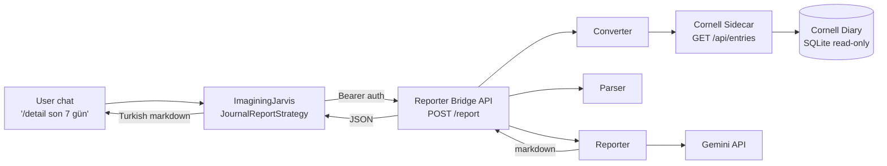

# Journal AI Reporter

Tag-driven AI reports over a personal Cornell-method journal. Type
`/detail`, `/todo`, `/concern`, `/success`, or `/date{15.04.2026}` in
ImaginingJarvis chat — get back a structured Turkish markdown report
generated by Gemini, grounded only in your own journal entries.

[](https://www.python.org)
[](https://fastapi.tiangolo.com)
[](#testing)
[](#testing)
[](LICENSE)

---

## Architecture



Three loosely-coupled services:

1. **Cornell sidecar** (`cornell_journal_api/`) — read-only HTTP wrapper
   over the Tauri Cornell Diary's SQLite file. Never modifies the source.
2. **Reporter Bridge** (`src/`) — Converter → Parser → Reporter pipeline,
   exposed as a single `POST /report` to Jarvis. Plus `/health`, `/tags`,
   `/report/file` for offline debugging.
3. **Jarvis JournalReportStrategy** — capability that runs inside
   ImaginingJarvis and proxies tag commands to the Bridge over HTTP.

Each module has a single responsibility. Errors in any leg degrade
gracefully into a Turkish user message, never a stack trace, never PII.

---

## Features

- **5 tag commands**: `/detail`, `/todo`, `/concern`, `/success`,
  `/date{dd.mm.yyyy}` — each with its own slice of the parsed tree and a
  dedicated prompt template + markdown renderer.
- **Deterministic categorization** before the AI ever sees content. Rules
  cover Turkish first (anxieties / fears / failures / achievements /
  milestones / positive moments / open / completed / deferred /
  reflections / observations) plus English fallbacks.
- **Prompt-injection defense**: user content is wrapped in
  `<user_journal>…</user_journal>` and any stray closing tag is rewritten
  to `[/user_journal]` before reaching Gemini. Verified by a dedicated
  security test.
- **Schema-mapped Cornell access**: the sidecar projects Cornell's actual
  `diary_entries` columns (7 cue title/content pairs + diary + summary +
  quote) onto the `RawEntry` shape the Reporter consumes.
- **First-class error mapping**: Cornell down → 502, Gemini rate limit →
  429, no entries → 404, invalid tag → 422, unauthorized → 401, all with
  stable `code` fields the client can branch on.
- **Per-route rate limiting** on `/report` (slowapi, 20/min default).
  `/health` and `/tags` stay open so liveness probes and frontend tag
  pickers don't compete with reports.
- **JSON structured logging** with request-id propagation; never logs
  prompts, responses, or journal content.

---

## Tech Stack

| Concern        | Choice                                        |
| -------------- | --------------------------------------------- |
| Web framework  | FastAPI 0.115                                 |
| Validation     | Pydantic v2                                   |
| HTTP client    | httpx (async, with timeout enforcement)       |
| AI             | google-generativeai (Gemini 2.0 Flash)        |
| Rate limiting  | slowapi                                       |
| DB (sidecar)   | SQLite via stdlib `sqlite3` (read-only URI)   |
| Test           | pytest, pytest-asyncio, respx, fastapi.TestClient |
| Settings       | pydantic-settings (env vars)                  |

---

## Installation

```bash
git clone <repo>
cd journal_ai_reporter
python3.11 -m venv .venv
.venv/bin/pip install -r requirements.txt
cp .env.example .env
# fill in CORNELL_API_URL, CORNELL_API_KEY, GEMINI_API_KEY, INTERNAL_API_KEY
```

Generate a strong internal key:

```bash
python -c "import secrets; print(secrets.token_urlsafe(32))"
```

---

## Configuration

| Env var                  | Description                                                        |
| ------------------------ | ------------------------------------------------------------------ |
| `CORNELL_API_URL`        | Sidecar base URL, e.g. `http://localhost:8001`                     |
| `CORNELL_API_KEY`        | X-API-Key the Reporter sends to the sidecar                        |
| `GEMINI_API_KEY`         | Google AI Studio key                                               |
| `GEMINI_MODEL`           | Default `gemini-2.0-flash`                                         |
| `INTERNAL_API_KEY`       | Bearer token Jarvis presents on `/report`                          |
| `ALLOWED_ORIGINS`        | CSV CORS whitelist; never `*`                                      |
| `APP_ENV`                | `development` / `staging` / `production`                           |
| `APP_DEBUG`              | `false` in prod                                                    |
| `LOG_LEVEL`              | `INFO` (default), `DEBUG` for local                                |
| `RATE_LIMIT_PER_MINUTE`  | Default 20                                                         |
| `HTTP_TIMEOUT_SECONDS`   | Cornell client timeout, default 30                                 |
| `GEMINI_TIMEOUT_SECONDS` | Gemini call timeout, default 60                                    |

Sidecar-only:

| Env var             | Description                                  |
| ------------------- | -------------------------------------------- |
| `CORNELL_DB_PATH`   | Absolute path to `cornell-diary.db`          |
| `CORNELL_API_KEY`   | Same value as `CORNELL_API_KEY` on the bridge |

---

## Usage

### Standalone — manual pipeline runs

```bash
# Hit the sidecar via the Converter and dump the normalized JSON
.venv/bin/python scripts/manual_test.py converter --last-30-days

# Categorize a Converter JSON file
.venv/bin/python scripts/manual_test.py parser --input raw_sample.json

# Full pipeline, dry-run prompt only (no Gemini call)
.venv/bin/python scripts/manual_test.py pipeline --tag /detail --last-days 7 --dry-run

# Full pipeline, real Gemini call (requires GEMINI_API_KEY)
.venv/bin/python scripts/manual_test.py pipeline --tag /todo --last-days 7
```

When `GEMINI_API_KEY` is unset, `pipeline` and `reporter` auto-switch to
`--dry-run` so the prompt assembly is observable without burning quota.

### Bridge API

```bash
# Run the bridge
.venv/bin/python -m uvicorn src.main:app --port 8002

# Run the sidecar (separate shell)
CORNELL_DB_PATH=/path/to/cornell-diary.db CORNELL_API_KEY=$CORNELL_API_KEY \
.venv/bin/python -m uvicorn cornell_journal_api.src.main:app --port 8001
```

Call from any HTTP client:

```bash
curl -X POST http://localhost:8002/report \
  -H "Authorization: Bearer $INTERNAL_API_KEY" \
  -H "Content-Type: application/json" \
  -d '{
    "tag": "/detail",
    "date_range": {"start": "2026-04-01", "end": "2026-04-30"}
  }'
```

OpenAPI docs live at `/docs`.

### Jarvis integration

Already wired in `ImageningJarvis` via
`backend/capabilities/journal/strategy.py`. Set `JOURNAL_REPORTER_URL`
and `JOURNAL_REPORTER_KEY` in Jarvis's `.env`, restart Jarvis, type
`/detail son 7 gün` in chat.

---

## API Reference

### `GET /health`

Liveness probe. Always 200, no auth.

### `GET /tags` (auth required)

Returns the supported tag whitelist and the `/date{...}` template.

```json
{ "whitelist": ["/detail", "/todo", "/concern", "/success"],
  "date_pattern": "/date{dd.mm.yyyy}" }
```

### `POST /report` (auth + rate limit)

Body:

```json
{
  "tag": "/detail" | "/todo" | "/concern" | "/success" | "/date{dd.mm.yyyy}",
  "date_range": { "start": "2026-04-01", "end": "2026-04-30" },
  "fetch_all": false
}
```

`date_range` and `fetch_all` are optional; default is the last 30 days.
For `/date{...}` tags `date_range` is ignored — the date inside the tag
defines the window.

Response:

```json
{
  "tag": "/detail",
  "generated_at": "2026-04-29T15:30:00Z",
  "date_range": { "start": "...", "end": "..." },
  "entry_count": 30,
  "content": { "summary": "...", "todos": {...}, ... },
  "raw_markdown": "# Günlük Raporu — /detail\n..."
}
```

### `POST /report/file` (auth, debug)

Multipart upload of a `ParsedCollection` JSON file plus a `tag` query
param. Skips Converter+Parser; runs only the Reporter. Useful when
Cornell is unreachable or for replaying a saved parse.

### Error shape

```json
{ "code": "stable_machine_readable_code", "message": "human-readable Turkish" }
```

| HTTP | Codes (non-exhaustive)                                                  |
| ---- | ----------------------------------------------------------------------- |
| 400  | invalid range, oversized upload                                         |
| 401  | `unauthorized`                                                          |
| 404  | `no_entries`, `date_not_in_range`                                       |
| 422  | Pydantic validation (invalid tag, malformed date_range)                 |
| 429  | `rate_limit`, `gemini_rate_limit`                                       |
| 502  | `cornell_unavailable`, `cornell_auth_error`, `invalid_ai_response`      |
| 503  | `gemini_unavailable`, `auth_misconfigured`                              |

---

## Tag Reference

| Tag                  | What you get                                                     |
| -------------------- | ---------------------------------------------------------------- |
| `/detail`            | Full report — summary, todos, concerns, successes, patterns, recommendation. |
| `/todo`              | Open / completed / deferred items + a one-paragraph analysis.    |
| `/concern`           | Anxieties / fears / failures with an empathic Turkish summary.   |
| `/success`           | Achievements / milestones / positive moments, motivational tone. |
| `/date{15.04.2026}`  | Day-specific narrative + highlights + emotional tone.            |

`/detail` is the kitchen-sink view. The single-axis tags trim the prompt
to one bucket so the AI's output is sharper.

---

## Security

This project follows a 13-rule protocol; details in
[`docs/THREAT_MODEL.md`](docs/THREAT_MODEL.md). Highlights:

1. **No hardcoded secrets** — every key reads from `.env` (gitignored).
2. **Pydantic validation** at every boundary; tags whitelisted + regex.
3. **Parameterized SQL** in the sidecar; table name is constant.
4. **30s/60s HTTP timeouts** for Cornell / Gemini respectively.
5. **slowapi rate limit** on `/report` (20/min default).
6. **CORS allowlist**, never `*`.
7. **Sanitized error envelopes** — no stack traces leaked to clients.
8. **PII-safe logs** — request-id, endpoint, status, duration only.
9. **Prompt-injection defense** — XML wrapping + closing-tag rewrite.
10. **Least privilege** on Gemini and Cornell keys (read/text only).
11. **AI output validated** with Pydantic + retry-on-parse-failure.
12. **Pinned dependencies** — exact versions in `requirements.txt`.
13. **OWASP API Top 10** checklist tracked in
    [`docs/OWASP_CHECKLIST.md`](docs/OWASP_CHECKLIST.md).

---

## Project Structure

```
journal_ai_reporter/
├── src/                              # Reporter Bridge (the main product)
│   ├── main.py                       # FastAPI entry, CORS, limiter, lifespan
│   ├── config.py                     # pydantic-settings
│   ├── logger.py                     # JSON logging
│   ├── exceptions.py                 # JournalReporterError hierarchy
│   ├── api/                          # Bridge HTTP layer
│   │   ├── routes.py                 # POST /report, GET /tags, POST /report/file
│   │   ├── dependencies.py           # bearer auth + service factories
│   │   ├── middleware.py             # request-id logging, exception handler
│   │   └── limiter.py                # shared slowapi.Limiter
│   └── modules/
│       ├── converter/                # Cornell HTTP → RawEntryCollection
│       ├── parser/                   # categorizer + ParsedCollection tree
│       └── reporter/                 # tag handlers + Gemini wrapper + prompts
├── cornell_journal_api/              # Read-only Cornell sidecar
│   └── src/
│       ├── main.py                   # GET /api/entries
│       ├── db.py                     # SQLite ro adapter, schema mapping
│       └── config.py
├── scripts/
│   ├── manual_test.py                # converter / parser / reporter / pipeline
│   └── seed_mock_data.py             # mock Cornell server (dev only)
├── tests/
│   ├── unit/
│   ├── integration/
│   └── conftest.py
├── docs/
│   ├── THREAT_MODEL.md
│   └── OWASP_CHECKLIST.md
├── requirements.txt                  # exact-pin
├── pyproject.toml
└── .env.example
```

---

## Testing

```bash
.venv/bin/python -m pytest                 # all 112 tests
.venv/bin/python -m pytest -m unit         # fast, mocked
.venv/bin/python -m pytest -m integration  # bridge + sidecar end-to-end
.venv/bin/python -m pytest -m security     # prompt-injection
```

Coverage breakdown:

| Layer                    | Coverage |
| ------------------------ | -------- |
| Reporter Bridge (`src/`) | 95% avg  |
| Sidecar (`cornell_journal_api/`) | 95% avg |
| Project total            | **93%**  |

---

## Roadmap

- Multi-user: Cornell DB scoping by device_id, per-user INTERNAL_API_KEY.
- Streaming responses: SSE on `/report` so long Gemini calls feel snappy.
- Web UI: minimal React frontend reusing Jarvis's `JournalReportCard`.
- Vector recall: embed historic entries so `/date{...}` answers can also
  surface contextually similar days.
- More tags: `/mood`, `/streak`, `/highlight{topic}`.

---

## License

MIT — see [`LICENSE`](LICENSE).
